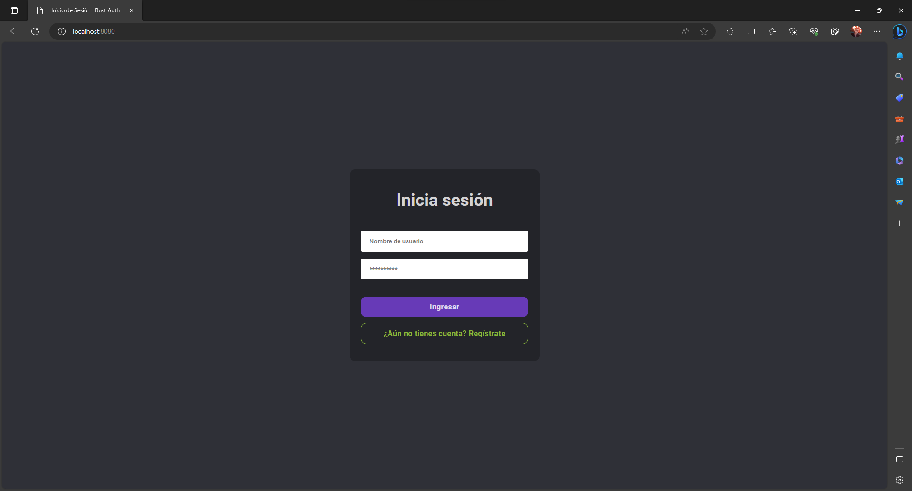
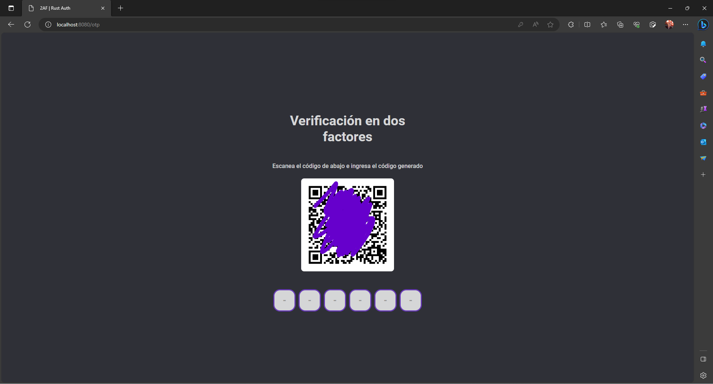
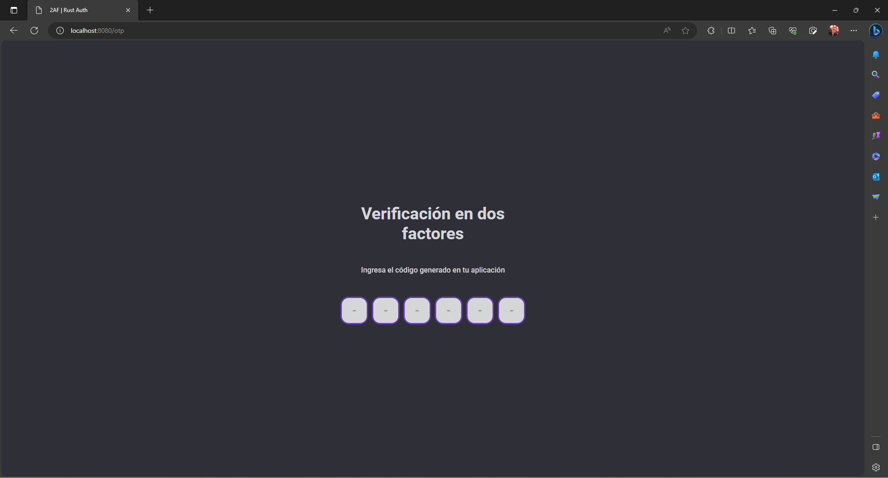
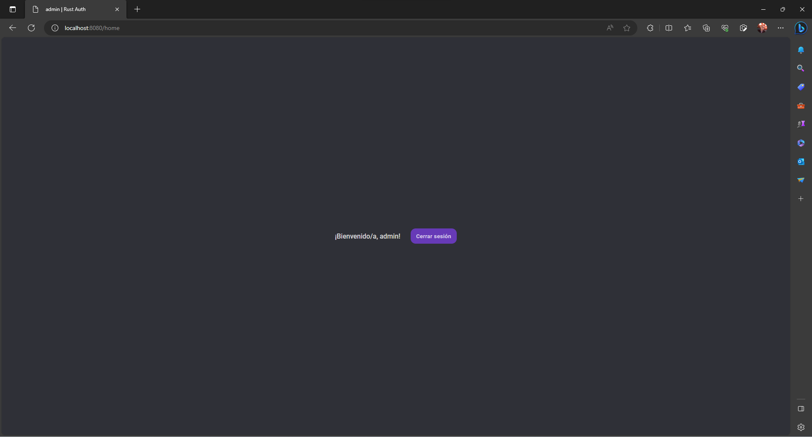

# Rust CRUD usando Axum

[Repositorio GitHub](https://github.com/dsolartec/rust-crud-axum)

## Instalación de Rust

Para instalar Rust solamente debes visitar la página de [rustup (Instalador oficial)](https://rustup.rs/), y ahí puedes elegir si usar el comando de la consola (Linux o MacOS) o descargar el ejecutable de instalación; posteriormente, leer y seguir los pasos del instalador usando la configuración por defecto.

## Ejecutar proyecto en la terminal

- **Paso 1** Instalar Rust (Ver [Instalación de Rust](#instalación-de-rust)).

- **Paso 2** Abrir una terminal en la carpeta donde esté el proyecto.

- **Paso 3** Ejecutar el siguiente comando: `cargo run`

- **Paso 4** Esperar que muestre el puerto :8080 en la consola.

## Licencia

Este proyecto está bajo la [licencia MIT](./LICENSE).

## Vista previa (UI)

<details>
    <summary>Inicio de sesión</summary>
    
</details>

<details>
    <summary>Registro</summary>
    
</details>

<details>
    <summary>Activar 2AF (Escanear QR)</summary>
    
</details>

<details>
    <summary>Verificación código 2AF</summary>
    
</details>

<details>
    <summary>Página de inicio</summary>
    
</details>

## Endpoints

### Autorizaciones

-   **POST** `/auth/logIn` - Inicio de sesión

    **Body**
    ```json
    {
        "username": "admin",
        "password": "admin"
    }
    ```

    **Respuesta exitosa**
    ```json
    {
        "access_token": "JWT"
    }
    ```

    **Códigos de respuesta**
    - `400` - Cuando el nombre de usuario o la contraseña son incorrectos.
    - `500` - Cuando haya ocurrido un error interno.
    - `200` - Cuando haya iniciado sesión exitosamente.

<br />

-   **POST** `/auth/signUp` - Registro

    **Body**
    ```json
    {
        "username": "admin",
        "password": "admin"
    }
    ```

    **Respuesta exitosa**
    ```json
    {
        "access_token": "JWT"
    }
    ```

    **Códigos de respuesta**
    - `400` - Cuando el nombre del usuario o la contraseña no son válidos.
    - `409` - Cuando el nombre de usuario ya está en uso.
    - `500` - Cuando haya ocurrido un error interno.
    - `201` - Cuando se haya registrado exitosamente.

<br />

-   **GET** `/auth/me` - Obtener mi información

    **Headers**
    ```json
    {
        "Authorization": "Bearer {access_token}"
    }
    ```

    **Respuesta exitosa**
    ```json
    {
        "id": 1,
        "username": "admin",
        "otp_enabled": false
    }
    ```

    **Códigos de respuesta**
    - `401` - Cuando el usuario autenticado no posee ninguno de los permisos requeridos.
    - `500` - Cuando haya ocurrido un error interno.
    - `200` - Cuando haya podido obtener la información.

### 2AF (TOTP)

-   **GET** `/auth/otp/qrCode` - Obtener el código QR

    **Query**
    - `auth` - Token de autorización

    **Headers**
    ```json
    {
        "Authorization": "Bearer {access_token}"
    }
    ```

    > **Nota:** El token de autorización se puede mandar por header o por los parámetros de la URL, esto con el fin de que se pueda usar en el atributo `src` de una imagen en HTML. **Ejemplo:** `/auth/otp/qrCode?auth=ey...`

    **Respuesta exitosa**

    Una imagen PNG.

    **Códigos de respuesta**
    - `401` - Cuando el usuario autenticado ya tiene activo el 2AF (escaneó el código previamente).
    - `500` - Cuando haya ocurrido un error interno.
    - `200` - Cuando haya podido obtener la información.

<br />

-   **PUT** `/auth/otp/enable/:otp_code` - Activar la autenticación en dos factores

    **Headers**
    ```json
    {
        "Authorization": "Bearer {access_token}"
    }
    ```

    **Respuesta exitosa**
    ```json
    {
        "access_token": "JWT"
    }
    ```

    **Códigos de respuesta**
    - `401` - Cuando el usuario autenticado ya tiene activo el 2AF (escaneó el código previamente).
    - `500` - Cuando haya ocurrido un error interno.
    - `200` - Cuando haya podido obtener todos los usuarios.

<br />

-   **POST** `/auth/otp/verify/:otp_code` - Verificar el código de la autenticación en dos factores

    **Headers**
    ```json
    {
        "Authorization": "Bearer {access_token}"
    }
    ```

    **Respuesta exitosa**
    ```json
    {
        "access_token": "JWT"
    }
    ```

    **Códigos de respuesta**
    - `401` - Cuando el usuario autenticado no tiene activo el 2AF o ya ingresó un código previamente.
    - `500` - Cuando haya ocurrido un error interno.
    - `200` - Cuando haya podido obtener todos los usuarios.

### Usuarios

-   **GET** `/users` - Obtener todos los usuarios

    **Permisos requeridos:** `users_read` o `users_full`

    **Headers**
    ```json
    {
        "Authorization": "Bearer {access_token}"
    }
    ```

    **Respuesta exitosa**
    ```json
    [
        {
            "id": 1,
            "username": "admin"
        }
    ]
    ```

    **Códigos de respuesta**
    - `401` - Cuando el usuario autenticado no posee ninguno de los permisos requeridos.
    - `500` - Cuando haya ocurrido un error interno.
    - `200` - Cuando haya podido obtener todos los usuarios.

<br />

-   **GET** `/users/id/:id` - Obtener un usuario usando su id

    **Permisos requeridos:** `users_read` o `users_full`

    **Headers**
    ```json
    {
        "Authorization": "Bearer {access_token}"
    }
    ```

    **Respuesta exitosa**
    ```json
    {
        "id": 1,
        "username": "admin"
    }
    ```

    **Códigos de respuesta**
    - `401` - Cuando el usuario autenticado no posee ninguno de los permisos requeridos.
    - `404` - Cuando el usuario no existe.
    - `500` - Cuando haya ocurrido un error interno.
    - `200` - Cuando haya podido obtener el usuario.

<br />

-   **GET** `/users/username/:username` - Obtener un usuario usando su nombre de usuario

    **Permisos requeridos:** `users_read` o `users_full`

    **Headers**
    ```json
    {
        "Authorization": "Bearer {access_token}"
    }
    ```

    **Respuesta exitosa**
    ```json
    {
        "id": 1,
        "username": "admin"
    }
    ```

    **Códigos de respuesta**
    - `401` - Cuando el usuario autenticado no posee ninguno de los permisos requeridos.
    - `404` - Cuando el usuario no existe.
    - `500` - Cuando haya ocurrido un error interno.
    - `200` - Cuando haya podido obtener el usuario.

<br />

-   **DELETE** `/users/username/:username` - Eliminar un usuario usando su nombre de usuario

    **Permisos requeridos:** `users_write` o `users_full`

    **Headers**
    ```json
    {
        "Authorization": "Bearer {access_token}"
    }
    ```

    **Códigos de respuesta**
    - `401` - Cuando el usuario autenticado no posee ninguno de los permisos requeridos.
    - `404` - Cuando el usuario no existe.
    - `409` - Cuando el usuario sea el mismo con el que te autenticaste.
    - `500` - Cuando haya ocurrido un error interno.
    - `204` - Cuando el usuario fue eliminado exitosamente.

<br />

-   **GET** `/users/username/:username/permissions` - Obtener los permisos de un usuario usando su nombre de usuario

    **Permisos requeridos:** `users_read` o `users_full`

    **Headers**
    ```json
    {
        "Authorization": "Bearer {access_token}"
    }
    ```

    **Respuesta exitosa**
    ```json
    [
        "users_full",
        "grant_permission"
    ]
    ```

    **Códigos de respuesta**
    - `401` - Cuando el usuario autenticado no posee ninguno de los permisos requeridos.
    - `404` - Cuando el usuario no existe.
    - `500` - Cuando haya ocurrido un error interno.
    - `200` - Cuando se haya podido obtener los permisos del usuario.

<br />

-   **POST** `/users/username/:username/permission/:permissionName` - Otorgarle un permiso usando su nombre de usuario

    **Permisos requeridos:** `grant_permission`

    **Headers**
    ```json
    {
        "Authorization": "Bearer {access_token}"
    }
    ```

    **Códigos de respuesta**
    - `401` - Cuando el usuario autenticado no posee ninguno de los permisos requeridos.
    - `404` - Cuando el usuario o el permiso no existen.
    - `409` - Cuando el usuario ya posee el permiso.
    - `500` - Cuando haya ocurrido un error interno.
    - `204` - Cuando el permiso fue otorgado al usuario exitosamente.

<br />

-   **DELETE** `/users/username/:username/permission/:permissionName` - Removerle el permiso previamente otorgado a un usuario usando su nombre de usuario

    **Permisos requeridos:** `revoke_permission`

    **Headers**
    ```json
    {
        "Authorization": "Bearer {access_token}"
    }
    ```

    **Códigos de respuesta**
    - `400` - Cuando el usuario no posee el permiso.
    - `401` - Cuando el usuario autenticado no posee ninguno de los permisos requeridos.
    - `404` - Cuando el usuario o el permiso no existen.
    - `409` - Cuando el usuario sea el mismo con el que te autenticaste.
    - `500` - Cuando haya ocurrido un error interno.
    - `204` - Cuando el permiso fue removido al usuario exitosamente.

### Permisos

-   **POST** `/permissions` - Crear un permiso

    **Permisos requeridos:** `permissions_write` o `permissions_full`

    **Headers**
    ```json
    {
        "Authorization": "Bearer {access_token}"
    }
    ```

    **Respuesta exitosa**
    ```json
    {
        "id": 7,
        "name": "grant_permission",
        "description": "Grant a permission to an user"
    }
    ```

    **Códigos de respuesta**
    - `400` - Cuando el nombre del permiso o la descripción no son válidos.
    - `401` - Cuando el usuario autenticado no posee ninguno de los permisos requeridos.
    - `409` - Cuando el nombre del permiso ya existe.
    - `500` - Cuando haya ocurrido un error interno.
    - `201` - Cuando haya podido crear el permiso.

<br />

-   **GET** `/permissions` - Obtener todos los permisos

    **Permisos requeridos:** `permissions_read` o `permissions_full`

    **Headers**
    ```json
    {
        "Authorization": "Bearer {access_token}"
    }
    ```

    **Respuesta exitosa**
    ```json
    [
        {
            "id": 7,
            "name": "grant_permission",
            "description": "Grant a permission to an user"
        }
    ]
    ```

    **Códigos de respuesta**
    - `401` - Cuando el usuario autenticado no posee ninguno de los permisos requeridos.
    - `500` - Cuando haya ocurrido un error interno.
    - `200` - Cuando haya podido obtener todos los permisos.

<br />

-   **GET** `/permissions/id/:id` - Obtener un permiso usando su id

    **Permisos requeridos:** `permissions_read` o `permissions_full`

    **Headers**
    ```json
    {
        "Authorization": "Bearer {access_token}"
    }
    ```

    **Respuesta exitosa**
    ```json
    {
        "id": 7,
        "name": "grant_permission",
        "description": "Grant a permission to an user"
    }
    ```

    **Códigos de respuesta**
    - `401` - Cuando el usuario autenticado no posee ninguno de los permisos requeridos.
    - `404` - Cuando el permiso no existe.
    - `500` - Cuando haya ocurrido un error interno.
    - `200` - Cuando haya podido obtener el permiso.

<br />

-   **GET** `/permissions/name/:permissionName` - Obtener un permiso usando su nombre

    **Permisos requeridos:** `permissions_read` o `permissions_full`

    **Headers**
    ```json
    {
        "Authorization": "Bearer {access_token}"
    }
    ```

    **Respuesta exitosa**
    ```json
    {
        "id": 7,
        "name": "grant_permission",
        "description": "Grant a permission to an user"
    }
    ```

    **Códigos de respuesta**
    - `401` - Cuando el usuario autenticado no posee ninguno de los permisos requeridos.
    - `404` - Cuando el permiso no existe.
    - `500` - Cuando haya ocurrido un error interno.
    - `200` - Cuando haya podido obtener el permiso.

<br />

-   **DELETE** `/permissions/name/:permissionName` - Eliminar un permiso usando su nombre

    **Permisos requeridos:** `permissions_write` o `permissions_full`

    **Headers**
    ```json
    {
        "Authorization": "Bearer {access_token}"
    }
    ```

    **Códigos de respuesta**
    - `401` - Cuando el usuario autenticado no posee ninguno de los permisos requeridos.
    - `404` - Cuando el permiso no existe.
    - `409` - Cuando el permiso no pueda ser eliminado.
    - `500` - Cuando haya ocurrido un error interno.
    - `204` - Cuando el permiso fue eliminado exitosamente.
